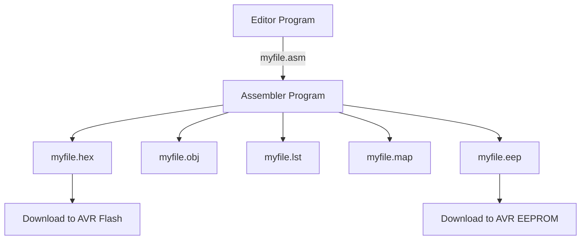

# Lecture 2: AVR Architecture and Assembly Language Programming
## {{ $slidev.configs.subject }}
### Semester {{ $slidev.configs.semester }}
#### Presented by {{ $slidev.configs.presenter }}

---

## Objectives

Upon completion of this chapter, you will be able to:

* Describe the AVR's 32 **general-purpose registers** (R0-R31) and their role in the CPU
* Use **LDI** and **ADD** to load immediate values and perform arithmetic in the GPRs
* Describe the AVR **data memory space** -- GPRs, I/O registers (SFRs), and internal SRAM -- and their address ranges
* Use **LDS**, **STS**, **IN**, **OUT**, and **MOV** to move data between registers, I/O, and SRAM
* Explain the bits of the AVR **status register (SREG)** and identify which instructions affect them
* Represent data in hex, binary, decimal, and ASCII formats using AVR assembler syntax
* Use assembler directives such as **.EQU**, **.SET**, **.ORG**, and **.INCLUDE**
* Describe the structure of an AVR assembly language program and how it is assembled into a ready-to-run program
* Explain the role of the **program counter** and the AVR **program (Flash) memory** space
* Describe the **RISC architecture** features implemented in the AVR

---

## Lecture Outline

<div class="text-sm">

1.  **The AVR CPU and Register File**
    * General-purpose registers R0-R31
    * The `LDI` and `ADD` instructions
    * The X/Y/Z pointer register pairs (preview)
2.  The AVR Data Memory and Addressing
    * GPRs, I/O registers (SFRs), and internal SRAM
    * `LDS`/`STS`, `IN`/`OUT`, and `MOV`
    * Addressing modes summary
3.  Status Register, Data Formats, and Program Structure
    * SREG flag bits: C, Z, N, V, S, H, T, I
    * Data representation and assembler directives
    * Assembly language program structure
4.  Assembling, Program Memory, and RISC Architecture
    * Assembling, linking, and running a program
    * The program counter and Flash program memory
    * RISC architecture features in the AVR

</div>

---
hideInToc: true
---

# Part 1
## Section 2.1: The AVR CPU and Register File

---

## CPUs Use Registers

* CPUs use **registers** to store data temporarily while it is processed.
* To program in Assembly language, we must understand the registers and architecture of the CPU, and the role they play in processing data.
* The AVR has only **one data type**: 8 bits. Any data larger than 8 bits must be broken into 8-bit chunks before it is processed.
* Each register's bits are numbered from the LSB (D0) to the MSB (D7):

```
 D7 | D6 | D5 | D4 | D3 | D2 | D1 | D0
```

* The AVR has **32 general-purpose registers (GPRs)**, named R0-R31, all 8 bits wide, located at the lowest addresses of data memory.

---
layout: image-right
backgroundSize: contain
image: /ch2_gpr_register_file.png
---

## The General-Purpose Register File

* R0-R31 occupy the **lowest addresses** of the AVR's data memory space (Figure 2-1).
* All 32 registers are **8 bits wide** -- the AVR has no other on-chip data type.
* The GPRs play the role that the **accumulator** plays in many other microprocessors: they can be used by all arithmetic and logic instructions.
* Two upper register pairs (R26:R27, R28:R29, R30:R31) double as the **X, Y, Z pointer registers** used for indirect addressing -- previewed later in this lecture and covered fully in a later chapter.

---

## The `LDI` (Load Immediate) Instruction

`LDI` copies an 8-bit **immediate** value into a general-purpose register.

```asm
LDI  Rd, K   ;load Rd (destination) with immediate value K
             ;Rd must be R16-R31
```

* `K` is an 8-bit value: 0-255 in decimal, or 00-FF in hex.
* **Rd must be R16-R31** -- one of the *upper 16* GPRs. `LDI` cannot target R0-R15.
* The "I" in `LDI` stands for **immediate**: the value is supplied right there with the instruction.

```asm {*}{lines:true}
LDI  R20, 0x25   ;load R20 with 0x25   (R20 = 0x25)
LDI  R31, 0x87   ;load 0x87 into R31   (R31 = 0x87)
LDI  R5,  0x99   ;INVALID -- R0-R15 not allowed with LDI
```

* Comments start with `;` (like `//` in C) and run to the end of the line.
* Notice the destination comes first: `LDI Rd,K` loads the right operand into the left operand.

---
layout: two-cols
---

## The `ADD` Instruction

```asm
ADD  Rd, Rr   ;ADD Rr to Rd and store the result in Rd
```

* `ADD` tells the CPU to add the value of `Rr` to `Rd` and put the result back into `Rd`.
* Unlike `LDI`, **any** GPR (R0-R31) may be used as `Rd` or `Rr`.

```asm {*}{lines:true}
LDI  R16, 0x25   ;load 0x25 into R16
LDI  R17, 0x34   ;load 0x34 into R17
ADD  R16, R17    ;R16 = R16 + R17
                 ;R16 = 0x59
```

::right::


*Figure 2-2: the GPRs feed the ALU; the Status Register captures the C, H, S, V, N, Z flags produced by every ALU operation (Section 2.4).*

---

## Preview: the X, Y, Z Pointer Registers

* Three of the upper register pairs have a **second identity** as 16-bit pointer registers, used for *indirect* addressing of data memory:

| Register pair | Pointer name |
|---|---|
| R27:R26 | **X** |
| R29:R28 | **Y** |
| R31:R30 | **Z** |

* As ordinary GPRs, X and Y and Z behave exactly like any other register with `LDI`, `ADD`, and so on (recall `LDI` still requires R16-R31, so only Y and Z -- not X's low byte R26 -- can be loaded directly).
* Their *pointer* role -- holding a 16-bit address so instructions like `LD`/`ST` can read or write SRAM indirectly -- is covered fully in a later chapter. For this lecture, all data-memory access uses **direct** addressing (`LDS`/`STS`), not the pointer registers.

---

## Lecture Outline

<div class="text-sm">

1.  **The AVR CPU and Register File**
    * General-purpose registers R0-R31
    * The `LDI` and `ADD` instructions
    * The X/Y/Z pointer register pairs (preview)
2.  The AVR Data Memory and Addressing
    * GPRs, I/O registers (SFRs), and internal SRAM
    * `LDS`/`STS`, `IN`/`OUT`, and `MOV`
    * Addressing modes summary
3.  Status Register, Data Formats, and Program Structure
    * SREG flag bits: C, Z, N, V, S, H, T, I
    * Data representation and assembler directives
    * Assembly language program structure
4.  Assembling, Program Memory, and RISC Architecture
    * Assembling, linking, and running a program
    * The program counter and Flash program memory
    * RISC architecture features in the AVR

</div>

---
hideInToc: true
---

# Part 2
## Sections 2.2-2.3: The AVR Data Memory and Addressing

---

## Two Kinds of Memory Space

* AVR microcontrollers have **two** separate memory spaces:
    * **Code (program) memory** -- stores the program; examined in Section 2.8.
    * **Data memory** -- stores data; the subject of this part.
* The data memory is composed of **three parts**:
    1. **GPRs** (general-purpose registers)
    2. **I/O memory** (SFRs -- special function registers)
    3. **Internal data SRAM**

---
layout: image-right
backgroundSize: contain
image: /ch2_data_memory_map.png
---

## The Data Memory Map

| Region | Address range |
|---|---|
| GPRs | `$0000`-`$001F` |
| I/O registers (SFRs) | `$0020`-`$005F` |
| Internal SRAM | `$0060` and up |

* The GPRs always occupy `$00`-`$1F`, **regardless of the AVR chip**.
* Standard I/O memory is always **64 bytes** (`$20`-`$5F`). Chips with more than 32 I/O pins (ATmega64/128/256, ...) add **extended I/O memory** above the standard 64 bytes.
* SRAM is the read/write **scratch pad** used to hold data and parameters; its size varies by chip.

---

## SRAM vs. EEPROM, and Data Memory Size

* **SRAM** loses its contents when power is off; **EEPROM** does not (covered in a later chapter). SRAM is for data that changes often; EEPROM is for data that must survive a power cycle.
* Data memory size = I/O registers + SRAM + GPRs (Table 2-1, abridged):

| Chip | Data Memory (bytes) | I/O (bytes) | SRAM (bytes) | GPRs |
|---|---|---|---|---|
| ATtiny25 | 224 | 64 | 128 | 32 |
| ATmega8 | 1120 | 64 | 1024 | 32 |
| ATmega32 | 2144 | 64 | 2048 | 32 |
| ATmega128 | 4352 | 64+160 | 4096 | 32 |

---

## `LDS` -- Load Direct from Data Space

```asm
LDS  Rd, k   ;load Rd with the contents of data memory location k
             ;k is an address between $0000 and $FFFF
```

* Copies one byte **from** any data memory location (GPR, I/O, or SRAM) **into** a GPR.

```asm {*|1-2|4-5|*}{lines:true}
LDS  R0, 0x300    ;R0 = contents of location 0x300
LDS  R1, 0x302    ;R1 = contents of location 0x302

ADD  R1, R0       ;R1 = R1 + R0
STS  0x302, R1    ;write the sum back to location 0x302
```

---

## `STS` -- Store Direct to Data Space

```asm
STS  k, Rr   ;store Rr into data memory location k
             ;k is an address between $0000 and $FFFF
```

* Copies a GPR **into** any data memory location. There is **no** way to store an immediate value directly into SRAM -- it must go through a GPR first.

```asm {*}{lines:true}
LDI  R20, 55       ;R20 = 55
STS  0x80, R20     ;[0x80] = R20 = 55
```

*Example: copy the contents of location 0x80 into location 0x81*
```asm
LDS  R20, 0x80     ;R20 = [0x80]
STS  0x81, R20     ;[0x81] = [0x80]
```

---

## `IN` and `OUT` -- Accessing I/O Registers

* Every I/O register has **two** addresses: its **I/O address** (0-63, used by `IN`/`OUT`) and its **data memory address** (`$20` higher, used by `LDS`/`STS`).

```asm
IN   Rd, A   ;load Rd with I/O location A     (0<=A<=63)
OUT  A, Rr   ;store Rr into I/O location A    (0<=A<=63)
```

* Names from the chip's include file (e.g. `M32DEF.INC`) may be used instead of numeric addresses:

```asm {*}{lines:true}
IN   R1, PIND    ;R1 = PIND
IN   R2, PINB    ;R2 = PINB
ADD  R1, R2      ;R1 = R1 + R2
STS  0x300, R1   ;store the sum to SRAM location 0x300
```

* `IN`/`OUT` are preferred over `LDS`/`STS` for I/O: they execute in **1 cycle** (vs. 2), are **2-byte** instructions (vs. 4-byte), and allow named registers -- but they can only reach the **standard** I/O memory, not extended I/O or SRAM.

---

## Worked Example: Toggle `PORTB` Forever

```asm {*|1|2|3|*}{lines:true}
AGAIN:  IN   R16, PINB    ;bring data from Port B into R16
        OUT  PORTC, R16   ;send it to Port C
        JMP  AGAIN        ;keep doing it forever
```

* `JMP` is an unconditional jump -- similar to `goto` in C. Looping is covered fully in the next chapter.
* A second example -- complement (`COM`) a value and re-output it forever:

```asm {*}{lines:true}
        LDI  R20, 0x55
        OUT  PORTB, R20   ;PORTB = 0x55
L1:     COM  R20          ;complement R20
        OUT  PORTB, R20   ;send the complemented value
        JMP  L1           ;repeat forever
```

---

## `MOV` -- Copy Between GPRs

```asm
MOV  Rd, Rr   ;Rd = Rr  (copy Rr to Rd)
              ;Rd and Rr can be any of R0-R31
```

```asm
MOV  R10, R20   ;R10 = R20
```

* If R20 held 60 before this instruction, **both** R20 and R10 hold 60 afterward.
* `MOV` is register-to-register only -- to move data to/from memory or I/O, use `LDS`/`STS` or `IN`/`OUT`.

---
layout: two-cols
---

## More ALU Instructions

**Table 2-2: two-operand instructions**

| Instr. | Operands | Meaning |
|---|---|---|
| `ADD` | Rd,Rr | Rd = Rd + Rr |
| `ADC` | Rd,Rr | Rd = Rd + Rr + C |
| `AND` | Rd,Rr | Rd = Rd AND Rr |
| `EOR` | Rd,Rr | Rd = Rd XOR Rr |
| `OR`  | Rd,Rr | Rd = Rd OR Rr |
| `SBC` | Rd,Rr | Rd = Rd - Rr - C |
| `SUB` | Rd,Rr | Rd = Rd - Rr |

::right::

**Table 2-3: single-operand instructions**

| Instr. | Operand | Meaning |
|---|---|---|
| `CLR` | Rd | Clear Rd |
| `INC` | Rd | Rd = Rd + 1 |
| `DEC` | Rd | Rd = Rd - 1 |
| `COM` | Rd | One's complement Rd |
| `NEG` | Rd | Two's complement Rd |
| `ROL`/`ROR` | Rd | Rotate left/right through carry |
| `LSL`/`LSR` | Rd | Logical shift left/right |
| `ASR` | Rd | Arithmetic shift right |
| `SWAP` | Rd | Swap nibbles in Rd |

---

## Addressing Modes Seen So Far

| Addressing mode | Example | Operand location |
|---|---|---|
| **Immediate** | `LDI R20,0x25` | Constant supplied with the instruction |
| **Register direct** | `ADD R16,R17` | Both operands in GPRs |
| **Direct data addressing** | `LDS R20,0x300` / `STS 0x300,R20` | Address given explicitly in the instruction |
| **Direct I/O addressing** | `IN R20,PINB` / `OUT PORTB,R20` | I/O address given explicitly (or by name) |

* All four are used constantly in AVR programs. **Indirect** addressing through the X/Y/Z pointer registers is covered in a later chapter.

---

## Worked Examples 2-1 and 2-2

**Example 2-1** -- fill SRAM `$212`-`$216` with constants:

```asm {*}{lines:true}
LDI  R16, 0x99   ;R16 = 0x99
STS  0x212, R16  ;[$212] = 0x99
LDI  R16, 0x85   ;R16 = 0x85
STS  0x213, R16  ;[$213] = 0x85
```
*(the pattern continues: `$214`=0x3F, `$215`=0x63, `$216`=0x12)*

**Example 2-2** -- add R21 to R20 twice, then store the result:

```asm {*}{lines:true}
LDI  R20, 5     ;R20 = 5
LDI  R21, 2     ;R21 = 2
ADD  R20, R21   ;R20 = 7
ADD  R20, R21   ;R20 = 9
STS  0x120, R20 ;[0x120] = 9
```

---

## Lecture Outline

<div class="text-sm">

1.  The AVR CPU and Register File
    * General-purpose registers R0-R31
    * The `LDI` and `ADD` instructions
    * The X/Y/Z pointer register pairs (preview)
2.  **The AVR Data Memory and Addressing**
    * GPRs, I/O registers (SFRs), and internal SRAM
    * `LDS`/`STS`, `IN`/`OUT`, and `MOV`
    * Addressing modes summary
3.  Status Register, Data Formats, and Program Structure
    * SREG flag bits: C, Z, N, V, S, H, T, I
    * Data representation and assembler directives
    * Assembly language program structure
4.  Assembling, Program Memory, and RISC Architecture
    * Assembling, linking, and running a program
    * The program counter and Flash program memory
    * RISC architecture features in the AVR

</div>

---
hideInToc: true
---

# Part 3
## Sections 2.4-2.6: Status Register, Data Formats, and Program Structure

---

## The AVR Status Register (SREG)

* Like all microprocessors, the AVR has a **flag register** to indicate arithmetic conditions -- called the **status register (SReg)**.
* SREG is an 8-bit register, also called the **flag register**:

| Bit | D7 | D6 | D5 | D4 | D3 | D2 | D1 | D0 |
|---|---|---|---|---|---|---|---|---|
| Name | I | T | H | S | V | N | Z | C |

* C, Z, N, V, S, H are **conditional flags**: each reflects a condition after an instruction executes, and each can drive a conditional branch (Chapter 3).

---
layout: image-right
backgroundSize: contain
image: /ch2_sreg_bits.png
---

## SREG Flag Bits

| Flag | Meaning |
|---|---|
| **C** | Carry -- set on a carry/borrow out of bit D7 |
| **Z** | Zero -- set when the result is 0 |
| **N** | Negative -- set when D7 (sign bit) of the result is 1 |
| **V** | Overflow -- set on signed-arithmetic overflow |
| **S** | Sign -- N XOR V |
| **H** | Half carry -- carry from D3 to D4 (used for BCD) |
| **T** | Bit copy storage |
| **I** | Global interrupt enable |

---
layout: two-cols
---

## `ADD` and the Flags: Two Worked Examples

**0x38 + 0x2F**
```
  0011 1000
+ 0010 1111
----------
  0110 0111   R16 = 0x67
```
C = 0 (no carry past D7)
H = 1 (carry from D3 to D4)
Z = 0 (result is not 0)

::right::

**0x9C + 0x64**
```
  1001 1100
+ 0110 0100
----------
1 0000 0000   R20 = 0x00
```
C = 1 (carry past D7)
H = 1 (carry from D3 to D4)
Z = 1 (result is 0)

---

## Flags and Decision Making

* Not every instruction affects every flag. Loads (`LDI`, `LDS`) affect **none**; logic instructions (`AND`, `OR`, ...) affect only some; `ADD`/`SUB` affect **all six**.

**Table 2-4 (abridged): instructions and the flags they affect**

| Instr. | C | Z | N | V | S | H |
|---|---|---|---|---|---|---|
| `ADD`, `ADC` | X | X | X | X | X | X |
| `SUB`, `SUBI` | X | X | X | X | X | X |
| `AND`, `OR` | | X | X | X | X | |
| `INC`, `DEC` | | X | X | X | X | |
| `COM` | X | X | X | X | X | |
| `TST` | | X | X | X | X | |

*Full list in Appendix A of the textbook. `X` means the bit can become 0 or 1.*

---

## Table 2-5: Branch Instructions Using Flags

| Instruction | Action |
|---|---|
| `BRLO` | Branch if C = 1 |
| `BRSH` | Branch if C = 0 |
| `BREQ` | Branch if Z = 1 |
| `BRNE` | Branch if Z = 0 |
| `BRMI` | Branch if N = 1 |
| `BRPL` | Branch if N = 0 |
| `BRVS` | Branch if V = 1 |
| `BRVC` | Branch if V = 0 |

*These instructions are the basis for `if`-like decisions and loops in AVR assembly -- covered in full in Chapter 3.*

---

## Section 2.5: Representing Data

The AVR assembler supports **four** ways to write a byte of data:

```asm {*}{lines:true}
LDI  R28, 0x75        ;hex, method 1
LDI  R22, $99         ;hex, method 2
LDI  R16, 0b10011001  ;binary (only one way to write it)
LDI  R17, 12          ;decimal -- nothing before/after the number
LDI  R23, '2'         ;ASCII character -- single quotes
```

* Hex: prefix with `0x`/`0X`, or with `$`.
* Binary: prefix with `0b`/`0B`.
* Decimal: no prefix or suffix at all.
* ASCII: enclose a single character in single quotes (`'A'` = 0x41); strings use double quotes with the `.DB` directive (covered in a later chapter).

---

## Assembler Directives: `.EQU` and `.SET`

* Directives (**pseudo-instructions**) give directions to the *assembler*, not the CPU. `.EQU`, `.SET`, `.ORG`, `.INCLUDE`, and `.DEVICE` are directives; `LDI` and `ADD` are not.

```asm
.EQU  COUNT = 0x25
      ...
      LDI  R21, COUNT     ;R21 = 0x25
```

* `.EQU` associates a name with a constant value or address; the assembler substitutes it everywhere the name appears.
* `.SET` does the same, but its value **may be reassigned** later in the program; a value defined with `.EQU` is fixed.
* `.EQU` is also how include files (e.g. `M32DEF.INC`) attach names like `PORTB` to their addresses:

```asm
.EQU  PORTB = 0x1B
```

---

## `.ORG`, `.INCLUDE`, and Label Rules

```asm
.ORG  0x0000          ;set the address for what follows (code or data)
.INCLUDE "M32DEF.INC" ;pull in register-name definitions for the ATmega32
```

* `.ORG` tells the assembler **where** to place the code or data that follows.
* `.INCLUDE` works like C's `#include` -- it brings in a file's contents (e.g. a chip's register-name definitions) at that point in the program.

**Label rules:** letters (upper/lower case), digits 0-9, and the special characters `? . @ _ $` are allowed; the **first character must be a letter**; every label must be **unique**; instruction mnemonics (`LDI`, `ADD`, ...) are reserved and cannot be used as labels.

---
layout: two-cols
---

## Section 2.6: Assembly Language Program Structure

An Assembly language instruction has **four fields**:

```
[label:]  mnemonic  [operands]  [;comment]
```

* **label** -- optional; names a line so it can be referenced (e.g. by a jump).
* **mnemonic + operands** -- do the real work; produce the machine **opcode**.
* **comment** -- begins with `;`; ignored by the assembler, essential for humans.

::right::

* **Mnemonic**: an easy-to-remember code for a machine instruction (e.g. `ADD`).
* **Assembler**: the program that translates Assembly language into machine code (opcode).
* **Machine language**: a program made only of 0s and 1s.
* **High-level language** (C, BASIC, ...): translated into machine code by a **compiler**, not an assembler.
* Assembly is a **low-level language** -- it deals directly with the internal structure of the CPU.

---

## Program 2-1: a Complete Assembly Program

```asm {*|4|6|7-9|10-13|14-15|*}{lines:true}
;AVR Assembly Language Program To Add Some Data.
;store SUM in SRAM location 0x300.

.EQU   SUM = 0x300        ;SRAM loc $300 for SUM

.ORG 00                   ;start at address 0
LDI    R16, 0x25          ;R16 = 0x25
LDI    R17, $34           ;R17 = 0x34
LDI    R18, 0b00110001    ;R18 = 0x31
ADD    R16, R17           ;add R17 to R16
ADD    R16, R18           ;add R18 to R16
LDI    R17, 11            ;R17 = 0x0B
ADD    R16, R17           ;add R17 to R16
STS    SUM, R16           ;save the SUM in loc $300
HERE:  JMP HERE           ;stay here forever
```

* `.EQU` and `.ORG` are directives (no opcode); everything else produces machine code.
* `HERE: JMP HERE` is a common idiom for "stop and stay" when there is no monitor program running underneath.

---

## Lecture Outline

<div class="text-sm">

1.  The AVR CPU and Register File
    * General-purpose registers R0-R31
    * The `LDI` and `ADD` instructions
    * The X/Y/Z pointer register pairs (preview)
2.  The AVR Data Memory and Addressing
    * GPRs, I/O registers (SFRs), and internal SRAM
    * `LDS`/`STS`, `IN`/`OUT`, and `MOV`
    * Addressing modes summary
3.  **Status Register, Data Formats, and Program Structure**
    * SREG flag bits: C, Z, N, V, S, H, T, I
    * Data representation and assembler directives
    * Assembly language program structure
4.  Assembling, Program Memory, and RISC Architecture
    * Assembling, linking, and running a program
    * The program counter and Flash program memory
    * RISC architecture features in the AVR

</div>

---
hideInToc: true
---

# Part 4
## Sections 2.7-2.9: Assembling, Program Memory, and RISC Architecture

---
layout: two-cols
---

## Section 2.7: From Source to Ready-to-Run

1. Type the program into a **text editor**, producing an ASCII source file with extension **`.asm`**.
2. Feed the `.asm` file to the **assembler**, which produces several output files.
3. Download the `.hex` file into Flash (and `.eep` into EEPROM, if used).



::right::

| Extension | Contents |
|---|---|
| `.asm` | source code (ASCII text) |
| `.obj` | object (machine) code |
| `.hex` | ready to burn into Flash |
| `.eep` | ready to burn into EEPROM |
| `.lst` | source + opcodes + memory used |
| `.map` | labels and their values |

* The assembler will **not** produce a `.hex` file until the source is free of syntax errors.

---

## A Sample Assembler Error, and the List File

```
AVRASM: AVR macro assembler 2.1.2
F:\AVR\Sample\Sample.asm(7): error: Invalid register
F:\AVR\Sample\Sample.asm(8): error: Operand(s) out of range in 'ldi r17,0x3432'
F:\AVR\Sample\Sample.asm(9): error: Undefined symbol: R38
Assembly failed, 4 errors, 0 warnings
```

* The `.lst` (list) file shows the source **and** the resulting opcodes side by side -- useful for seeing exactly how each instruction was assembled:

```
000000 e205        LDI R16, 0x25    ;R16 = 0x25
000003 0f01        ADD R16, R17     ;add R17 to R16
000007 9300 0300   STS SUM, R16     ;save the SUM in loc $300
000009 940c 0009   HERE: JMP HERE   ;stay here forever
```

---

## Section 2.10: Viewing Registers with AVR Studio

* **AVR Studio** is Atmel's free assembler + simulator IDE.
* A simulator lets you **single-step** a program and watch registers and memory change after each instruction -- one of the best ways to build intuition for the material in this chapter.
* Useful AVR Studio windows: **Memory** (view any data memory region), **Disassembler** (source next to machine code, with a pointer showing the next instruction to execute), **I/O View** (watch individual I/O registers such as `PORTB`).

---

## Section 2.8: the Program Counter (PC)

* The **PC** is the most important register in the CPU: it always holds the address of the **next instruction to be fetched**.
* Every AVR wakes up (on reset) with **PC = 0x0000** -- so the first opcode must always be placed at address 0 (via `.ORG 0`).
* The wider the PC, the more program memory it can address:

| PC width | Max locations |
|---|---|
| 14-bit | 16K |
| 16-bit | 64K |
| up to 22-bit | 4M (the AVR family maximum) |

* Each Flash location is **2 bytes** wide (the AVR is *word-addressable*), so a 22-bit PC can address up to **8M bytes** of code -- though no shipping AVR yet uses the full range.

---
layout: image-right
backgroundSize: contain
image: /ch2_program_rom_ranges.png
---

## Table 2-7: On-Chip ROM Size and Address Range

| Chip | ROM | Address range |
|---|---|---|
| ATtiny25 | 2K | `00000`-`003FF` |
| ATmega8 | 8K | `00000`-`00FFF` |
| ATmega32 | 32K | `00000`-`03FFF` |
| ATmega64 | 64K | `00000`-`07FFF` |
| ATmega128 | 128K | `00000`-`0FFFF` |

* The **first** location of on-chip ROM is always `00000`; only the **last** location changes with ROM size.

---

## Fetch and Execute, Step by Step

Walking through **Program 2-1** after it is burned into ROM:

1. **PC = 0x0000.** Fetch `E205` = `LDI R16,0x25`. Execute it (R16 = 0x25). **PC -> 0x0001**.
2. Fetch `E314` = `LDI R17,0x34`. Execute. **PC -> 0x0002**.
3. This continues, one 2-byte instruction at a time, through the `ADD`s.
4. `STS SUM,R16` is a **4-byte** (2-word) instruction -- it occupies addresses `0007` and `0008`. After it executes, **PC -> 0x0009**.
5. `HERE: JMP HERE` is also 4 bytes (`0009`-`000A`). After it executes, **PC = 0x0009 again** -- an infinite loop.

* Because the PC always points at the *next* instruction, some CPUs (notably the x86) call it the **instruction pointer**.

---
layout: two-cols
---

## Instruction Sizes and Machine Code

* Almost all AVR instructions are **2 bytes**; the exceptions (`STS`, `LDS`, `JMP`, ...) are **4 bytes**.

**2-byte instructions**
```
LDI Rd,K:  1110 KKKK dddd KKKK
ADD Rd,Rr: 0000 11rd dddd rrrr
IN  Rd,A:  1011 0AAd dddd AAAA
OUT A,Rr:  1011 1AAr rrrr AAAA
```

::right::

**4-byte instructions**
```
STS k,Rr:  1001 001r rrrr 0000
           kkkk kkkk kkkk kkkk

LDS Rd,k:  1001 000d dddd 0000
           kkkk kkkk kkkk kkkk

JMP k:     1001 010k kkkk 110k
           kkkk kkkk kkkk kkkk
           (0<=k<=4M -- all of Flash)
```

---

## Little Endian in the AVR

* The AVR (like x86) is **little endian**: the **low** byte of a value goes to the **low** memory address; the **high** byte goes to the **high** address.
* Contrast with **big endian** (e.g. classic Freescale/Motorola CPUs), where the high byte goes to the low address.

| Address | High byte | Low byte |
|---|---|---|
| 00000 | E2 | 05 |
| 00001 | E3 | 14 |
| 00002 | E3 | 21 |

*(from the Program 2-1 list file -- the opcode `E205` is stored as `05` then `E2`)*

---
layout: image-right
backgroundSize: contain
image: /ch2_harvard_architecture.png
---

## Harvard Architecture in the AVR

* The AVR uses **Harvard architecture**: separate buses for **program** (code) memory and **data** memory.
* **Program bus:** 16 bits wide (matches the 2-byte instruction width); address bus as wide as the PC.
* **Data bus:** 8 bits wide (one byte at a time); 16-bit address bus (up to 64K of data memory).
* Executing `LDS R20,0x90` puts `0x90` on the **data** address bus and reads the byte back over the **data** bus -- entirely separate from the program bus used to fetch the `LDS` opcode itself.

---

## Section 2.9: RISC vs. CISC

* In the early 1980s, computer architects split into two camps:
    * **CISC** (Complex Instruction Set Computer) -- pack as many, and as powerful, instructions as possible into the CPU.
    * **RISC** (Reduced Instruction Set Computer) -- use a small set of simple instructions, executed very fast.
* The AVR is a **RISC** microcontroller.

---

## Features of RISC, as Implemented in the AVR

| # | Feature | AVR implementation |
|---|---|---|
| 1 | Fixed instruction size | Every instruction is 2 or 4 bytes (never 1 or 3) |
| 2 | Large register set | 32 GPRs -- reduces the need for a large stack |
| 3 | Small instruction set | ~130 instructions in the ATmega, vs. hundreds in CISC |
| 4 | Mostly single-cycle | Over 95% of instructions execute in 1 clock cycle |
| 5 | Separate buses | Harvard architecture -- code and data on separate buses |
| 6 | Hardwired control | No microcode -- instructions decode directly in hardware |
| 7 | Load/store architecture | No instruction operates directly on external memory; data must be loaded into a GPR first |

---

## Why RISC? The Trade-offs

* **Advantage:** because instructions are simple, uniform, and hardwired (not microcoded), the CPU decodes and executes them very fast -- over 95% in a single clock cycle.
* **Disadvantage:** a small instruction set means Assembly programming is more tedious (more instructions are needed to do the same job) and programs are larger -- an acceptable trade since memory is cheap.
* RISC's load/store idea was pioneered by the Cray-1 supercomputer (1976); the term was popularized by David Patterson (UC Berkeley, 1980). Even modern CISC chips (e.g. the Pentium) now borrow RISC techniques internally.

---

## Lecture Outline

<div class="text-sm">

1.  The AVR CPU and Register File
    * General-purpose registers R0-R31
    * The `LDI` and `ADD` instructions
    * The X/Y/Z pointer register pairs (preview)
2.  The AVR Data Memory and Addressing
    * GPRs, I/O registers (SFRs), and internal SRAM
    * `LDS`/`STS`, `IN`/`OUT`, and `MOV`
    * Addressing modes summary
3.  Status Register, Data Formats, and Program Structure
    * SREG flag bits: C, Z, N, V, S, H, T, I
    * Data representation and assembler directives
    * Assembly language program structure
4.  **Assembling, Program Memory, and RISC Architecture**
    * Assembling, linking, and running a program
    * The program counter and Flash program memory
    * RISC architecture features in the AVR

</div>

---
layout: default
---

## Summary

* **The register file:** the AVR has 32 general-purpose registers, R0-R31, each 8 bits wide -- the only data type the AVR supports natively. `LDI` (immediate-to-register, R16-R31 only) and `ADD` (register-to-register, any GPR) were the first two instructions studied. Three upper register pairs double as the 16-bit **X, Y, Z** pointer registers, previewed here and used for indirect addressing in a later chapter.
* **Data memory:** composed of the GPRs (`$00`-`$1F`), I/O registers/SFRs (`$20`-`$5F`, plus extended I/O on larger chips), and internal SRAM (`$60` and up). `LDS`/`STS` access any data memory location directly; `IN`/`OUT` give faster, smaller access to standard I/O; `MOV` copies between GPRs.
* **Addressing modes:** immediate, register direct, direct data addressing, and direct I/O addressing were all used in this chapter's examples.
* **Status register (SREG):** an 8-bit flag register with bits I, T, H, S, V, N, Z, C. `ADD`/`SUB` affect all six conditional flags; loads affect none. These flags drive the conditional branch instructions covered in Chapter 3.
* **Data formats and directives:** data can be written in hex (`0x`/`$`), binary (`0b`), decimal, or ASCII (`'x'`). `.EQU`/`.SET` name constants and addresses; `.ORG` sets the origin; `.INCLUDE` pulls in a chip's register definitions.
* **Program structure:** `[label:] mnemonic [operands] [;comment]`. Instructions produce opcodes; directives (pseudo-instructions) only guide the assembler.
* **Assembling and running:** editor -> assembler -> `.hex`/`.obj`/`.lst`/`.map`/`.eep` -> download to Flash/EEPROM. AVR Studio provides a free simulator for single-stepping a program.
* **Program counter and Flash:** the PC always holds the address of the next instruction and starts at `0x0000` on reset. AVR instructions are 2 or 4 bytes; the AVR is little endian and uses a 16-bit-wide Harvard program bus.
* **RISC architecture:** fixed instruction size, a large register set, a small instruction set, mostly single-cycle execution, separate code/data buses, hardwired control, and load/store architecture -- all implemented in the AVR.
